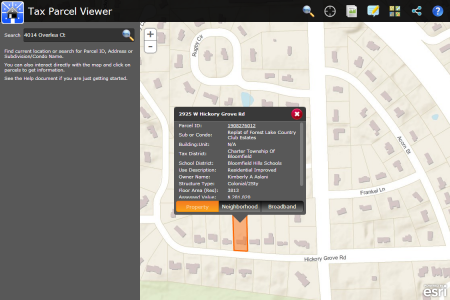

# tax-parcel-viewer

The Tax Parcel Viewer is a configuration of ArcGIS and JavaScript application that provides the general public and other interested parties local government property tax and assessment information and supplements that information with lifestyle and internet broadband information for a given neighborhood.  It is a single application that can be deployed by local governments and used by citizens on a desktop PC, mobile phone, and tablet device.

[Try the Tax Parcel Viewer application](http://links.esri.com/localgovernment/tryit/TaxParcelViewer/)

## Features

* Search for a parcel by Parcel ID, Address, or by subdivision name
* Review property, lifestyle, and broadband information for a given parcel
* Generate standard property maps and reports
* Provide feedback to a local government
* Share parcel information using social media

## Requirements

**Start now using Esri-supplied sample services**

You can start using the application now by setting it up on a web server running Microsoft Internet Information Services (IIS) and using sample services supplied by Esri.
You'll need to convert to an application in IIS and use the ASP .NET 4.0. application pool.

**Start now using your own services**

For more information on requirements and publication steps, see [Tax Parcel Viewer](http://links.esri.com/localgovernment/help/10.2/TaxParcelViewer) help.

## Resources

Additional [information and sample data](http://www.arcgis.com/home/item.html?id=23cc5b90b78d45e0bd51ede193328568) are available for the application.

Learn more about Esri's [ArcGIS for Local Government maps and apps](http://solutions.arcgis.com/local-government/).

Show me a list of other [Local Government GitHub repositories](http://esri.github.io/#Local-Government).

This application uses the 3.11 version of [Esri's ArcGIS API for JavaScript](http://help.arcgis.com/en/webapi/javascript/arcgis/); see the site for concepts, samples, and a reference for using the API to create mapping web sites.

[New to Github? Get started here.](http://htmlpreview.github.com/?https://github.com/Esri/esri.github.com/blob/master/help/esri-getting-to-know-github.html)

## Issues

Find a bug or want to request a new feature?  Please let us know by submitting an issue.

## Contributing

Esri welcomes contributions from anyone and everyone.
Please see our [guidelines for contributing](https://github.com/esri/contributing).

## Licensing

Copyright 2013 Esri

Licensed under the Apache License, Version 2.0 (the "License");
you may not use this file except in compliance with the License.
You may obtain a copy of the License at

   http://www.apache.org/licenses/LICENSE-2.0

Unless required by applicable law or agreed to in writing, software
distributed under the License is distributed on an "AS IS" BASIS,
WITHOUT WARRANTIES OR CONDITIONS OF ANY KIND, either express or implied.
See the License for the specific language governing permissions and
limitations under the License.

A copy of the license is available in the repository's
[LICENSE.txt](LICENSE.txt) file.

